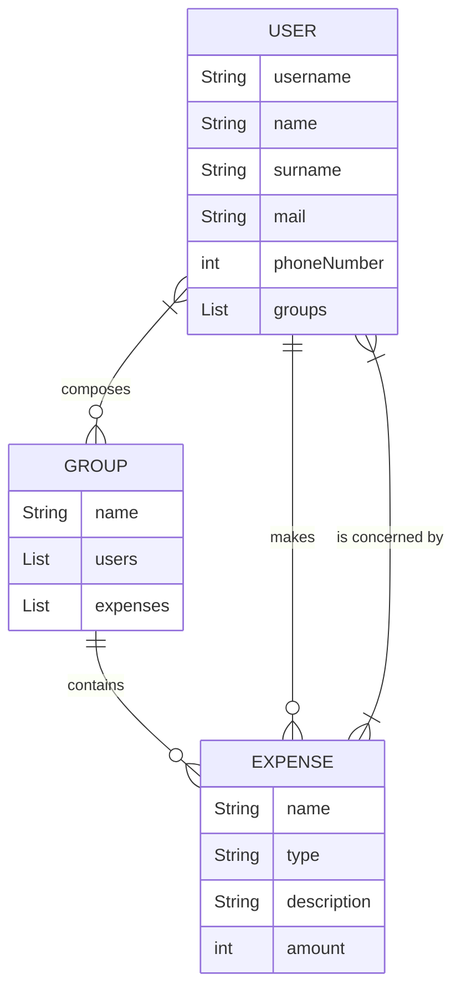

```mermaid

erDiagram
    USER }|--o{ GROUP : composes
    GROUP ||--o{ EXPENSE : contains
    USER ||--o{ EXPENSE : makes
    USER }|--|{ EXPENSE : "is concerned by"

USER {
    String username
    String name 
    String surname
    String mail 
    int phoneNumber 
    List groups
}
    
GROUP {
    String name
    List users 
    List expenses
}

EXPENSE {
    String name
    String type
    String description 
    int amount 
}

```