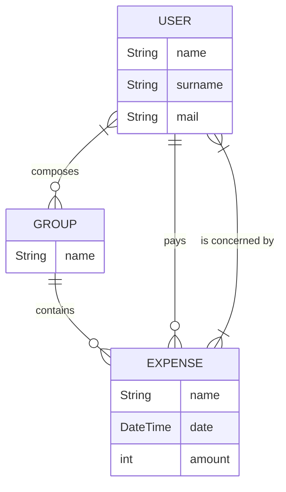

```mermaid

erDiagram
    USER }|--o{ GROUP : composes
    GROUP ||--o{ EXPENSE : contains
    USER ||--o{ EXPENSE : pays
    USER }|--|{ EXPENSE : "is concerned by"

USER {
    String name
    String surname
    String mail
}

GROUP {
    String name
}

EXPENSE {
    String name
    DateTime date
    int amount
}

```
